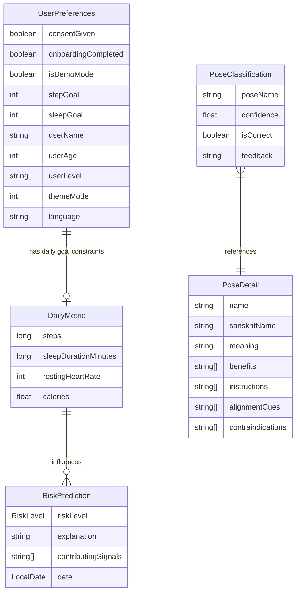

# YogaAI

YogaAI is a modern Android application built with **Jetpack Compose** that helps users practice Yoga, track their progress, and analyze their poses.
It leverages **AI** (via local or remote models) to personalize the yoga experience and provide real-time feedback.

## ✨ Features

- **Home (with Health Tracking)**: Main dashboard for accessing daily practices, recommendations, and integrated health metrics. Connected with **Health Connect** to track daily streaks, calories burned, and steps.
- **Yoga Detector**: Real-time privacy-first pose detection using on-device computer vision.
- **Smart Onboarding**: Responsive and personalized introduction to the app's features.
- **Settings**: Manage preferences, theme settings, and health permissions.

## 🛠 Tech Stack

- **Language**: [Kotlin](https://kotlinlang.org/)
- **UI Framework**: [Jetpack Compose](https://developer.android.com/jetpack/compose) (Material 3)
- **Architecture**: Clean Architecture with Feature Modules
- **Dependency Injection**: [Koin](https://insert-koin.io/)
- **Network**: [Ktor](https://ktor.io/)
- **Database**: [Room](https://developer.android.com/training/data-storage/room)
- **Navigation**: [Navigation Compose](https://developer.android.com/jetpack/compose/navigation)
- **Health Data**: [Health Connect SDK](https://developer.android.com/health-and-fitness/guides/health-connect)
- **Sustainability**: [Gemini Nano](https://ai.google.dev/edge/gemini/nano) (On-device LLM for explanations)
- **Storage**: [DataStore Preferences](https://developer.android.com/topic/libraries/architecture/datastore)
- **Logging**: [Timber](https://github.com/JakeWharton/timber)
- **AI/ML**: [MediaPipe](https://developers.google.com/mediapipe) (Vision)
- **Camera**: [CameraX](https://developer.android.com/media/camera/camerax)
- **Analytics/Crash Reporting**: [Firebase Crashlytics](https://firebase.google.com/docs/crashlytics)
- **Background Work**: [WorkManager](https://developer.android.com/topic/libraries/architecture/workmanager)

## 📁 Project Structure

The project follows a standard multi-module structure for better scalability:

- **:app**: The main entry point that wires all features together.
- **:features**: Contains all UI components, business logic, and shared core infrastructure (networking, database, models, Health Connect integration, and navigation).

## 🚀 Setup & Build

1. Clone the repository.
2. Open in Android Studio (Ladybug or newer recommended).
3. Sync Gradle project.
4. Run on an emulator or device (Min SDK 24).

## 🎨 Design

YogaAI features a custom **Wellness Theme** designed for tranquility and clarity:
- **Palette**: "Sage & Cream" - A soothing blend of Sage Green (`#95C495`), Cream White (`#F9F9F4`), and Earthy accents (`#BCAAA4`).
- **Typography**: Clean, readable sans-serif type scale optimized for instructional content.
- **Responsive**: Adaptive layouts verified for Phones, Foldables, and Tablets.

## 📊 Entity Relationship Diagram

The following ER diagram outlines the core data models and their relationships within the YogaAI application.

