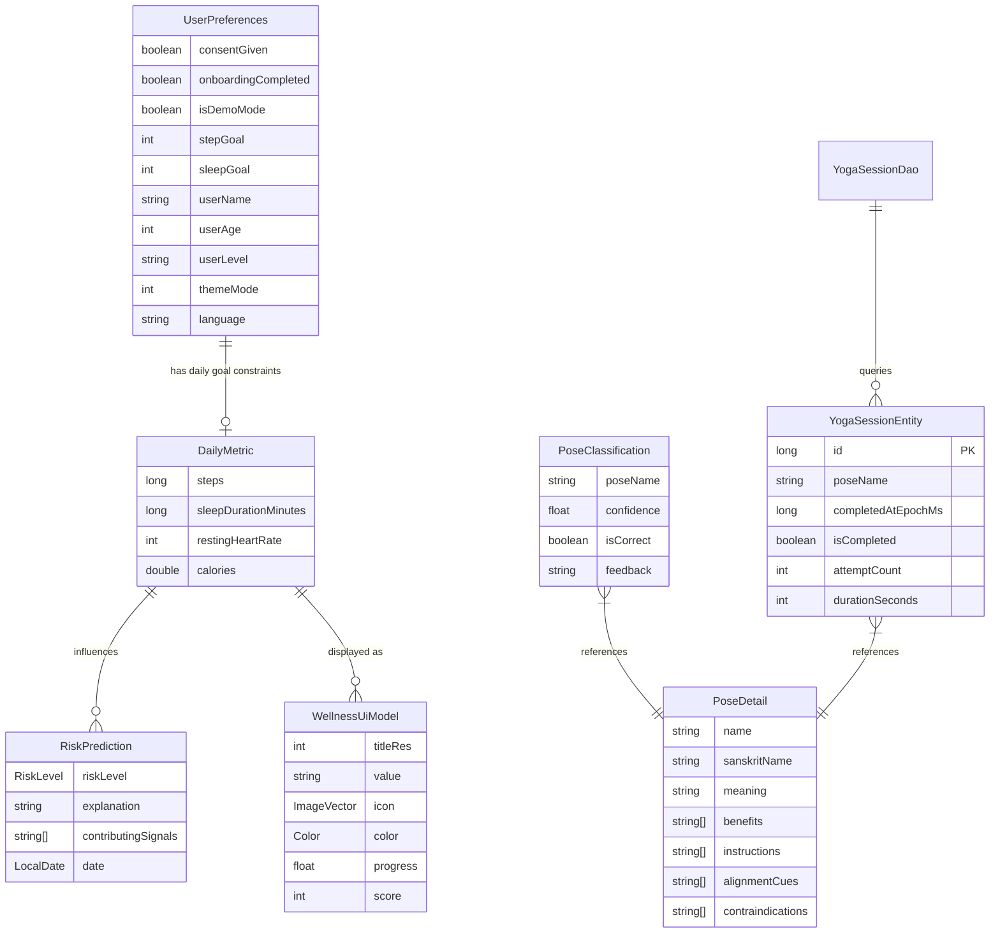

# YogaAI

YogaAI is a modern Android application built with **Jetpack Compose** that helps users practice yoga, track their wellness, and analyze their poses in real time using on-device AI.

---

## Features

- **Home Dashboard** — Daily wellness overview with risk prediction, streaks, calories, and step count. Integrates with [Health Connect](https://developer.android.com/health-and-fitness/guides/health-connect) to pull live health data.
- **Yoga Detector** — Real-time pose detection via [MediaPipe](https://developers.google.com/mediapipe) and [CameraX](https://developer.android.com/media/camera/camerax). Provides live audio feedback via Text-to-Speech and tracks hold time per pose.
- **Pose Results** — Post-session summary with pose details, benefits, alignment cues, and instructions sourced from an on-device pose library.
- **Pose History** — Per-session records (pose name, hold duration, attempt count, completion status) persisted in a Room database and displayed in a grouped timeline (Today / Yesterday / date).
- **Smart Onboarding** — 12-screen questionnaire collecting name, age, experience level, goals, and health consent. Responsive layout adapts for phones, foldables, and tablets.
- **Settings** — Theme selection (system/light/dark), dynamic color (Android 12+), language preferences, profile info, Health Connect management, rate/share, and app version.

---

## Tech Stack

| Layer | Technology |
|---|---|
| Language | [Kotlin](https://kotlinlang.org/) |
| UI | [Jetpack Compose](https://developer.android.com/jetpack/compose) + Material 3 |
| Architecture | MVI (Model-View-Intent) + Clean Architecture |
| Dependency Injection | [Koin](https://insert-koin.io/) |
| Navigation | [Navigation Compose](https://developer.android.com/jetpack/compose/navigation) |
| Health Data | [Health Connect SDK](https://developer.android.com/health-and-fitness/guides/health-connect) |
| AI / Pose Detection | [MediaPipe Tasks Vision](https://developers.google.com/mediapipe/solutions/vision/pose_landmarker) |
| Camera | [CameraX](https://developer.android.com/media/camera/camerax) |
| Storage | [DataStore Preferences](https://developer.android.com/topic/libraries/architecture/datastore) (settings) + [Room](https://developer.android.com/training/data-storage/room) (session history) |
| Logging | [Timber](https://github.com/JakeWharton/timber) |
| Crash Reporting | [Firebase Crashlytics](https://firebase.google.com/docs/crashlytics) |
| Background Work | [WorkManager](https://developer.android.com/topic/libraries/architecture/workmanager) |

---

## Architecture

YogaAI follows **MVI (Model-View-Intent)** on the presentation layer, layered over a clean data → domain → UI separation.

### Presentation Layer

Every screen has four parts living in the `ui` package of its feature:

| Part | Description |
|---|---|
| `XxxState` | Immutable data class holding all UI state, including permission flags |
| `XxxAction` | Sealed interface of every user interaction (button clicks, lifecycle events) |
| `XxxEvent` | Sealed interface of one-time side effects (navigation, snackbars) |
| `XxxViewModel` | Holds `StateFlow<XxxState>`, processes `onAction()`, emits `Channel<XxxEvent>` |

```
User interaction
      │
      ▼
onAction(XxxAction)          ← single entry point into the ViewModel
      │
      ▼
ViewModel updates _state     ← via _state.update { ... }
      │
      ├──► StateFlow<XxxState>  ─► XxxScreen (stateless, previewable)
      │
      └──► Channel<XxxEvent>   ─► XxxRoot  (observes events, owns ViewModel)
```

#### Composable split

- **`XxxRoot`** — holds the ViewModel via `koinViewModel()`, observes events with `ObserveAsEvents`, launches permission requests, and passes `state` + `onAction` down.
- **`XxxScreen`** — receives only `state: XxxState` and `onAction: (XxxAction) -> Unit`. Pure and fully previewable.

#### Core utilities

- **`UiText`** (`core/presentation`) — sealed interface wrapping `DynamicString` or `StringResource` for safe, localizable error messages.
- **`ObserveAsEvents`** (`core/presentation`) — lifecycle-aware `Flow` collector for one-time events using `repeatOnLifecycle(STARTED)`.

### Data Layer

- **Repositories** are defined as interfaces in `domain/` and implemented in `data/repository/`.
- **`HomeRepository`** reads health metrics from Health Connect via `HealthConnectManager`, falling back to `MockWellnessDataSource` when unavailable.
- **`YogaRepository`** wraps MediaPipe `PoseLandmarker` in `LIVE_STREAM` mode and dispatches results via `YogaRepositoryListener`.
- **`UserPreferences`** persists all user settings via DataStore.

### Dependency Injection (Koin)

Three Koin modules are assembled in `YogaApp`:

| Module | Contents |
|---|---|
| `coreDataModule` | `UserPreferences`, `HealthConnectManager` |
| `featuresModule` | Repositories, `PoseClassifier`, all ViewModels |
| `appModule` | `MainViewModel` |

---

## Project Structure

```
YogaAI/
├── app/                          # Application entry point
│   └── src/main/
│       ├── YogaApp.kt            # Koin initialization
│       ├── MainActivity.kt       # Single activity, theme, window size
│       ├── MainViewModel.kt      # Destination routing (onboarding vs home)
│       ├── navigation/           # AppDestinations (route constants)
│       └── ui/MainScreen.kt      # Scaffold + bottom nav wrapper
│
└── features/                     # All feature code (library module)
    └── src/main/
        └── core/
        │   ├── HealthConnectManager.kt
        │   ├── UserPreferences.kt
        │   ├── di/               # Koin modules
        │   ├── navigation/       # NavHost, bottom bar, destinations
        │   └── presentation/     # UiText, ObserveAsEvents
        │
        └── features/
            ├── common/
            │   ├── audio/        # TextToSpeechManager
            │   └── ui/           # ZenMascot, DevicePreviews
            ├── home/
            │   ├── domain/       # HomeRepository interface
            │   ├── data/         # HomeRepositoryImpl, MockWellnessDataSource
            │   └── ui/           # HomeState/Action/Event, HomeViewModel,
            │                     # HomeRoot, HomeScreen, WellnessUiModel
            ├── yoga/
            │   ├── domain/       # YogaRepository interface, PoseDetail models
            │   ├── data/         # YogaRepositoryImpl, PoseClassifier
            │   └── ui/           # YogaDetectorState/Action/Event, ViewModel,
            │                     # YogaDetectorRoot, YogaDetectorScreen, PoseResultScreen
            ├── settings/
            │   └── ui/           # SettingsState/Action/Event, SettingsViewModel,
            │                     # SettingsRoot, SettingsScreen, SettingsComponents
            ├── onboarding/
            │   └── ui/           # OnboardingState/Action/Event, OnboardingViewModel,
            │                     # OnboardingScreen
            ├── history/
            │   └── ui/           # PoseHistoryState/Action, PoseHistoryViewModel,
            │                     # PoseHistoryScreen, PoseHistoryUiItem
            ├── connect/
            │   └── ui/           # ConnectScreen, ConnectComponents
            ├── splash/
            │   └── ui/           # SplashScreen, SplashComponents
            └── ui/theme/         # YogaAITheme, Color, Shape, Type
```

---

## Setup & Build

**Requirements:**
- Android Studio Ladybug (2024.2.1) or newer
- JDK 17
- Min SDK: 26 | Target SDK: 34 | Compile SDK: 35

**Steps:**
1. Clone the repository.
2. Open the project in Android Studio.
3. Let Gradle sync complete.
4. Run on a physical device or emulator (API 26+).

> **Health Connect** requires a physical device or an emulator with Health Connect installed. The app automatically falls back to mock wellness data when Health Connect is unavailable.

---

## Design

YogaAI uses a custom **Wellness Theme** built on Material 3:

- **Palette**: Deep violet primary (`#6750A4`), amber accent, teal highlight — with full dark mode support and dynamic color on Android 12+.
- **Typography**: Clean, readable sans-serif scale optimized for instructional and metric content.
- **Shapes**: Rounded corners throughout (`extraLarge` on sheets, `large` on cards).
- **Responsive**: Adaptive layouts verified on phones, foldables, and tablets via `WindowWidthSizeClass`.
- **Mascot**: Animated `ZenMascot` composable with three states — `HAPPY`, `MEDITATIVE`, and `ENCOURAGING` — rendered entirely on Canvas with breathing and blink animations.

---

## Data Model


